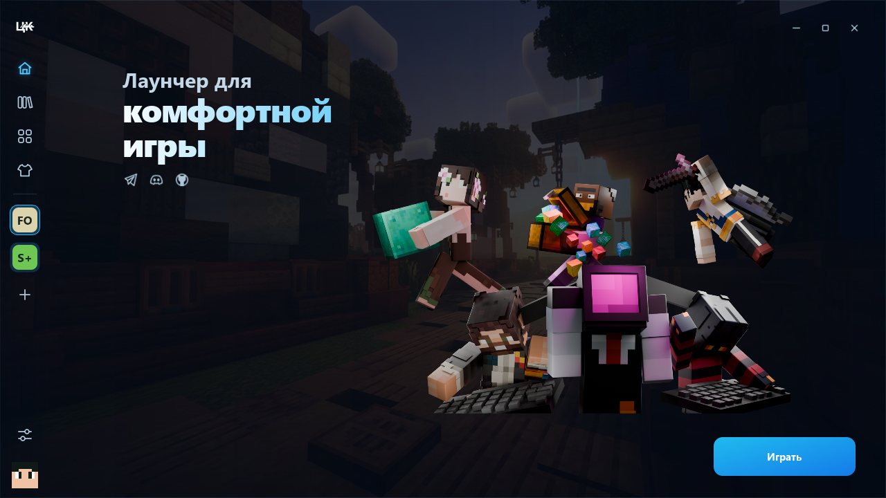

# ЦК Лаунчер

Лаунчер для комфортной игры в Minecraft: Java Edition на Windows.

[Telegram](https://t.me/comfortcentr) · [Discord](https://discord.gg/2CkZsVN8nm)

> Независимый проект. Не является официальным продуктом Minecraft и не связан с Mojang или Microsoft.

## Нативная версия 0.2

Основной интерфейс перенесён на Qt Widgets. Игровое ядро Rust отделено от оболочки; версии для современных и старых Windows собираются раздельно. Инструкция, ограничения Legacy и проверка выпусков: [docs/NATIVE_BUILD.md](docs/NATIVE_BUILD.md).

Результаты изменений: [что исправлено и проверено](docs/audit/implementation-status.md). Диагностика исходной версии: [отчёт](docs/audit/2026-09-07-diagnostics.md), [анализ PoC](docs/audit/poc-mrpack.md).

## Нативная beta 0.2.3

Исправлено воспроизведение SPEmotes: движение всего тела и его масштаб, положение центра наклона, сгибы локтей и коленей, переходы обратно в обычную стойку. Модель можно вращать мышью во время эмоций. Подробнее: [изменения 0.2.3-beta.1](docs/releases/v0.2.3-beta.1.md).

Фирменный тёмный установщик, компактные портретные карточки скинов, эмоции со сгибами рук и тела и полноценные страницы проектов Modrinth. Сборки и контент открываются кликом по всей карточке; описание оформлено в Markdown, версии и установка находятся на той же странице. Звуки и плавные анимации отключаются независимо в настройках. Подробнее: [изменения 0.2.2-beta.1](docs/releases/v0.2.2-beta.1.md).



[Скины и плащи](docs/screenshots/native/skins.png) · [Каталог](docs/screenshots/native/catalog.png). Снимки сделаны с реального Qt-интерфейса на тестовых данных; это не учётная запись пользователя.

## Возможности

- вход через Microsoft с проверкой лицензии Minecraft;
- отдельная библиотека версий и сборок;
- поиск модпаков, модов, ресурспаков и шейдеров через Modrinth;
- фильтрация по версии Minecraft, загрузчику и категории;
- просмотр описания проекта и выбор конкретного релиза;
- установка сборок из Modrinth и локальных файлов `.mrpack`;
- поддержка Vanilla, Fabric и Quilt при создании и запуске сборок;
- управление установленным контентом, файлами, мирами и журналами;
- установка подходящей Java и настройка оперативной памяти;
- автоматическое обновление modern/legacy прямо из Qt-лаунчера с проверкой криптографической подписи ZIP;
- управление скинами и плащами лицензионного аккаунта;
- единый индикатор установки, который сохраняется при переходе между вкладками.
- звуки кнопок, выбора сборки и скина, запуска и завершения игры;
- периодические эмоции предпросмотра скина: кивок, приветствие рукой, разведение рук и поклон; вращение мышью сохранено.

## Безопасность

- пароль вводится только на официальной странице Microsoft — лаунчер его не видит и не хранит;
- авторизация использует OAuth 2.0 Authorization Code с PKCE и одноразовый `state`, защищающий локальный callback от подмены;
- refresh-токены хранятся отдельно от SQLite в Windows Credential Manager, защищённом учётной записью Windows;
- Rust-ядро не возвращает токены в Qt или React/WebView и не помещает их в события интерфейса;
- известные секреты и поля `access_token`/`refresh_token` вырезаются из журналов, включая данные, разделённые между порциями вывода процесса;
- Qt форматирует Markdown без браузера и JavaScript; описание не может читать локальные файлы, изображения проходят через ограниченный HTTPS-загрузчик, внешние ссылки открываются только по явному клику; в переходной оболочке действует CSP;
- пути архивов и библиотек проверяются против выхода за каталог и ссылок; файлы модпаков требуют хеш и размер, архивы проверяются до распаковки;
- локальный модпак сначала проходит предпросмотр с подтверждением, а загрузки имеют ограничения размера и разрешённых HTTPS-источников;
- «Показать в Проводнике» выделяет файл без его запуска, журналы очищаются до вывода и экспорта;
- Qt-оболочка скачивает обновление только с GitHub Releases этого репозитория, проверяет его встроенным ключом Minisign и только после этого заменяет файлы;

Это снижает риск кражи токена со стороны веб-контента, логов и подменённых обновлений. Как и любое локальное приложение, лаунчер не может защитить данные от вредоносной программы, уже запущенной с правами самого пользователя или администратора Windows.

Microsoft Application (Client) ID: `69a61395-3c9e-485e-8662-dcb1bfa73472`

## Технологии

- Qt Widgets 6 / 5 и общее ядро Rust;
- переходная оболочка Tauri 2 / React 19 / TypeScript;
- SQLite;
- Windows Credential Manager.

## Сборка переходной оболочки

Требуются Windows 10/11 x64, Node.js, npm, Rust MSVC и WebView2 Runtime.

```powershell
cd app
npm install
npm run test
npm run tauri -- build
```

## Подписанные обновления переходной оболочки

Лаунчер проверяет `latest.json` в последнем GitHub Release. Для каждого выпуска нужны NSIS-установщик, его файл `.sig` и `latest.json` с той же подписью. Закрытый ключ из `.signing/` намеренно исключён из Git и должен храниться отдельно; его потеря лишит уже установленные копии возможности доверять новым обновлениям.

Дополнительные сведения: [`app/docs/privacy-and-logs.md`](app/docs/privacy-and-logs.md) и [`app/docs/windows-acceptance.md`](app/docs/windows-acceptance.md).

## Правовая информация

Minecraft является товарным знаком Microsoft Corporation. Проект разрабатывается независимо и не одобрен Mojang или Microsoft. Пользователь обязан соблюдать Minecraft EULA и Minecraft Usage Guidelines.

## Лицензия

Исходный код ЦК Лаунчера распространяется на условиях [GNU Affero General Public License v3.0](LICENSE) (`AGPL-3.0-only`). При распространении изменённой версии или предоставлении её пользователям через сеть необходимо сохранить эту лицензию и предоставить соответствующий исходный код.

Название «ЦК Лаунчер», логотипы, изображения, звуки и другие фирменные материалы не лицензируются по AGPL и остаются защищёнными. Условия их использования приведены в [TRADEMARKS.md](TRADEMARKS.md). Сторонние компоненты сохраняют собственные лицензии.
